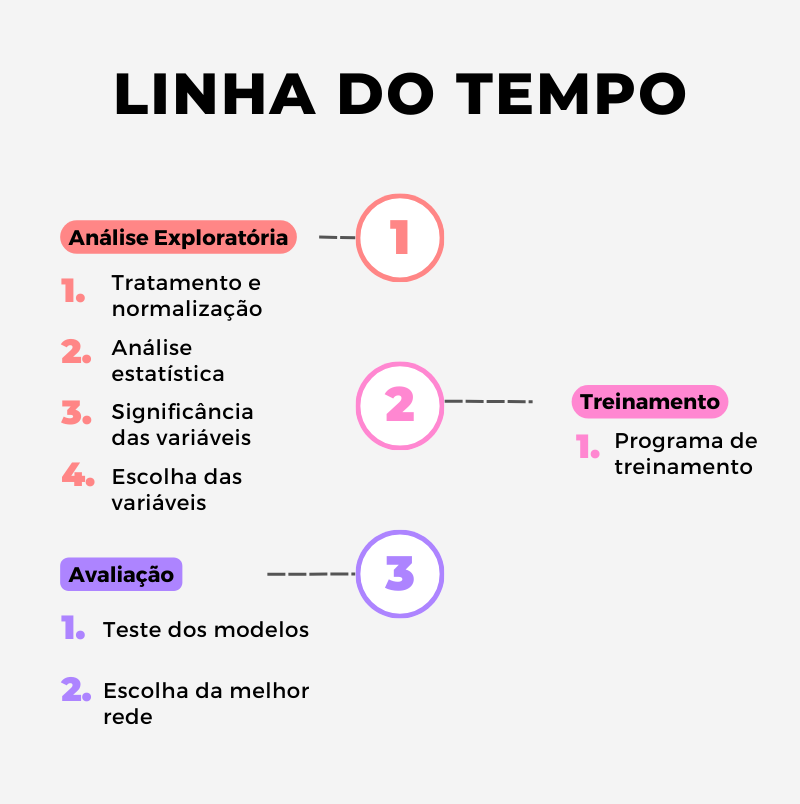

# Rede Neural Artificial
Rede Neural desenvolvida a fim de realizar todos os processos, desde o trabalho de tratamento de um conjunto de dados brutos, até o treinamento e teste de uma rede do tipo MLP. Esta ferramenta foi elaborada com o propósito de contribuir para a obtenção parcial de nota na disciplina de Inteligência Artificial.

---

## Etapas:

Informações mais detalhadas podem ser consultadas em [Relatório Final](https://github.com/cassiamariane/rede-neural-artificial/relatorio_final.pdf).

---

## Tecnologias utilizadas
|                           |                                         |
| ------------------------- | --------------------------------------- |
|  |  |